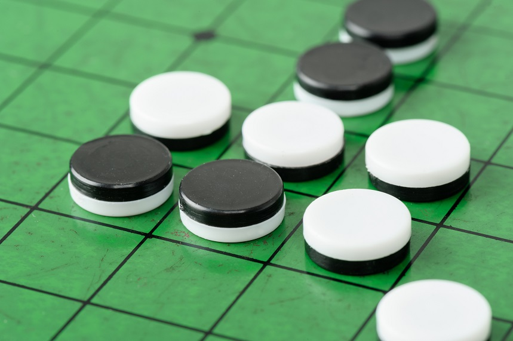

# Othello-Game-AI

_Project assignment of Artificial Intelligence course in Taiwan, NDHU CSIE_

---
## About othello game
There are sixty-four identical game pieces called disks, which are light on one side and dark on the other. Players take turns placing disks on the board with their assigned color facing up. During a play, any disks of the opponent's color that are in a straight line and bounded by the disk just placed and another disk of the current player's color are turned over to the current player's color. The objective of the game is to have the majority of disks turned to display one's color when the last playable empty square is filled.

### Rules

For the specific game of Othello, the game begins with four disks placed in a square in the middle of the grid, two facing light-side-up, two dark-side-up, so that the same-colored disks are on a diagonal. Each player may make one move per turn after set-up begins, and black typically goes first.

Each piece you place must capture an opponent's piece. That means you have to place your pieces adjacent to one of the opponent's pieces. You can't put your piece in a square that doesn't lead to a capture.

Capturing a piece -- When you put your piece beside the opponent piece in any position, that piece and all adjacent pieces become yours. You can put your piece beside the opponent's, as well as diagonally. Both options lead to captures.

Flanking The Opponent -- A key Reversi strategy is flanking your opponent's pieces. If you can get a piece at each end of a row or column (straight or diagonally) then every piece in the row between your two pieces is captured. By mastering flanking, you can take multiple rows of pieces per turn.

Ending The Game -- Gameplay continues like this until the board is full and no pieces can be captured. If players end up with the same number of pieces each on the board, the game is a draw.

## Minimax Algorithm in Game Theory
Minimax is a kind of backtracking algorithm that is used in decision making and game theory to find the optimal move for a player, assuming that your opponent also plays optimally.

In Min-max tree, the odd & even level are represented as two players are called Maximizer and Minimizer. The maximizer tries to get the highest score possible while the minimizer tries to do the opposite and get the lowest score possible.

### Alpha-Beta Pruning
In general, when it comes to search problem, the higher level we search from, the more computing cost we get. Alpha-Beta Pruning is an optimization technique for minimax algorithm. The core conception is pruning unnecessary branches to reduce computing cost. Through add two variables α & β (α = the best value that the maximizer currently can guarantee at that level or above, β = best value that the minimizer currently can guarantee at that level or above), we can know whether there already exists a better move available. If it exists, pruning the subtree. 

_For further detailed methods description, please see `Othello_Game.pptx`_

## Starting the code
---
